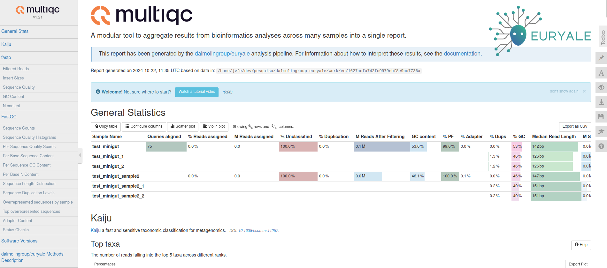
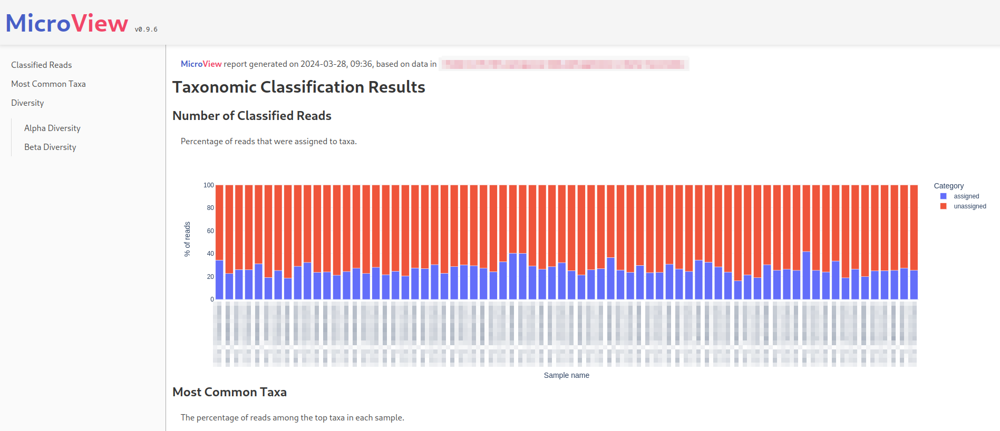
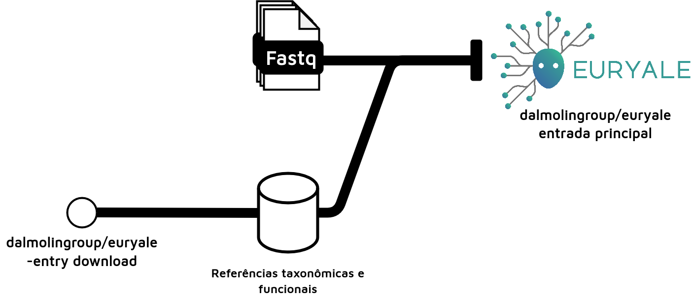

# Discussão

Ao averiguarmos o estado da arte dos fluxos de trabalho computacional presentes na área da metagenômica, pudemos concluir que a adoção de tecnologias de conteinerização e orquestradores de execução ainda é um tanto limitada. Essas limitações tornam-se mais evidentes sobretudo no contexto de metodologias de metagenômica livres de montagem. Tais metodologias são mais escassas e menos computacionalmente intensas quando comparadas às abordagens baseadas em montagem. Ainda assim, elas necessitam processamento adequado, de forma reprodutível, replicável e automatizável, especialmente por possibilitarem uma análise realizável em infraestruturas de menor porte e por possuírem melhor sensibilidade ao tratar dados com baixa cobertura [@ayling2020], ambos fatores comuns quando se tratando da produção e processamento de dados metagenômicos em ambientes com financiamento científico limitado, como no sul global.

No contexto de possíveis metodologias, decidimos então aplicar os princípios postos para a metodologia MEDUSA [@morais2022], que apresentou resultados superiores a fluxos de trabalho semelhantes, além de ter obtido suas ferramentas a partir de curadoria manual, com rigorosos processos de benchmarking. Portanto, tomando vantagem da curadoria precedente, decidimos então re-implementar o MEDUSA, utilizando-se agora do gerenciador de workflows Nextflow a de tecnologias de contêinerização Docker e Singularity.

Nextflow foi escolhido sobretudo devido à facilidade e rapidez de desenvolvimento, conjunta ao suporte multiplataforma mais abrangente que o orquestrador anteriormente escolhido para o MEDUSA, Snakemake. Ademais, Nextflow já foi selecionado como a melhor opção para desenvolvimento de fluxos de trabalho em comparações anteriores [@jackson2021] [@celebi2023], assim como a tecnologia de orquestração de *workflows* que mais cresce em citações atualmente [@langerEmpoweringBioinformaticsCommunities2024]. Outro aspecto que levou à decisão por Nextflow foi a existência da comunidade nf-core, que realiza trabalhos de curadoria de fluxos de trabalho em bioinformática e fornecem templates para a criação de workflows modulares, altamente parametrizáveis e que possibilitem melhor manutenção a longo prazo [@ewels2020].

Apesar de reimplementarmos o MEDUSA por completo como EURYALE, também avançamos em algumas limitações do software original, sobretudo interpretabilidade dos dados e parametrização.

Quanto ao primeiro ponto, notávamos uma clara ausência, no MEDUSA, de visualizações e relatórios que forneçam informações preliminares e análises exploratórias acerca do conjunto de dados processado. No entanto, acessibilidade de dados através de relatórios e figuras interativas é essencial para tornar análises mais compreensíveis e reprodutíveis, sobretudo em um campo com complexidade alta de informação, com muitos arquivos gerados por análise, como a metagenômica.

Nesse sentido, primeiro interligamos as diversas ferramentas agora presentes no EURYALE através do MultiQC, um agregador de informação de dados de bioinformática [@ewels2016] que permitiu disponibilizar um relatório interativo e configurável com informações a respeito das etapas de controle de qualidade, classificação taxonômica e do alinhamento que precede a anotação funcional (Figura \@ref(fig:multiqc)).

```{r multiqc, fig.cap = "Exemplo do cabeçalho de um relatório gerado através da ferramenta MultiQC, implementada como parte integrante do EURYALE.", fig.pos = "H", fig.align='center'}

```

Ademais, através da implementação de uma nova ferramenta, MicroView, também inclusa no EURYALE, disponibilizamos também ao usuário métricas pré-calculadas de diversidade, ilustrando, de forma inicial e exploratória, o quadro geral resultante da classificação taxonômica (Figura \@ref(fig:microview)).

```{r microview, fig.cap = "Exemplo do cabeçalho de um relatório gerado através da ferramenta Microview, escrita em Python e implementada como parte integrante do EURYALE.", fig.pos = "H", fig.align='center'}

```

O MicroView também atua como um pacote na linguagem Python de programação, possibilitando sua execução fora do fluxo de trabalho. De forma geral, tais relatórios, com visualizações interativas, aumentam a acessibilidade de dados das análises realizadas com o EURYALE, facilitando não apenas a exploração inicial e a geração de descobertas científicas pelos pesquisadores usuários da metodologia, mas também a exploração posterior dos resultados, promovendo re-análises [@perkel2018].

Vale ressaltar também os aprimoramentos em padronização de software e parametrização trazidos da mudança do MEDUSA para o EURYALE. Ao implementarmos a metodologia, optamos por utilizar a infraestrutura da nf-core, uma comunidade que busca padronizar o desenvolvimento de fluxos de trabalho que utilizam Nextflow, com ênfase em modularidade, testes contínuos e documentação [@langerEmpoweringBioinformaticsCommunities2024] [@ewels2020]. A comunidade implementa uma suíte de software em Python para a criação e manutenção de fluxos de trabalho (<https://nf-co.re/docs/nf-core-tools/installation>), que foi amplamente utilizada no desenvolvimento do EURYALE. Ao utilizarmos das ferramentas e diretrizes da nf-core, pudemos superar algo que foi a principal crítica de usuários em relação ao MEDUSA: A estaticidade das referências e a pouca parametrização.

Quanto ao primeiro ponto, optamos por uma solução que possibilite a utilização de bancos de dados referência equivalentes aos utilizados pelo MEDUSA, que é o que tomamos como padrão da análise. Nesse sentido, implementamos uma entrada alternativa ao fluxo de trabalho (`-entry download`\`), que possibilita que os usuários transfiram os bancos de dados referência para sua máquina de análise, alimentando assim o *workflow* propriamente dito (Figura \@ref(fig:entries)).

```{r entries, fig.cap = "Diagrama ilustrando como a entrada de download do EURYALE adquire os bancos de dados que alimentam a entrada principal. Com uma análise típica do zero sendo constituída por ambas etapas.", fig.pos = "H", fig.align='center'}

```

Apesar disso, devido à modularidade advinda do *template* *nf-core*, o EURYALE é modelado para funcionar com quaisquer outro banco de dado compatível com as suas ferramentas integrantes. Dessa maneira, o usuário pode tanto modificar os parâmetros de *download* na entrada específica, quanto modificar diretamente os parâmetros de referência presentes na entrada principal do *workflow*, caso ele possua referências pré-adquiridas. Esses detalhes funcionais distinguem a usabilidade do EURYALE com a de seu precedente, não requerendo que os usuários alterem o código fonte para utilizar referências diferentes.

Além disso, adicionamos mais parâmetros ao EURYALE, parâmetros estes tanto que alterem as etapas de análise quanto aqueles que alteram os recursos computacionais alocados a estas etapas. A exemplo dessa mudança, podemos ver como a metodologia agora apoia um passo opcional de montagem, semelhante ao descrito no artigo original do MEDUSA, no entanto não aplicado diretamente na sua versão orquestrável original. O novo fluxo de trabalho também oferece mais opções de classificação taxonômica, além de parâmetros que possibilitam desabilitar diferentes passos de análise, como a descontaminação de leituras do hospedeiro, possibilitando que a abordagem se adapte a diferentes contextos de análise. Adicionalmente, outro ponto originado pela utilização do template *nf-core* são os diferentes rótulos de alocação de recursos, que permitem um gerenciamento fácil, da quantidade de recursos que pode ser alocada a cada passo de análise, através de um único arquivo de configuração. Essa adição permite que a metodologia seja executada em diferentes infraestruturas computacionais.

Em última instância, vale ressaltar como a utilização do *template* *nf-core* também possibilita a implantação do fluxo de trabalho na *Seqera Platform*, com a geração automática de uma interface gráfica, permitindo a usuários executar a metodologia sem necessariamente utilizarem uma interface em linha de comando, dado que, é claro, possuam cadastro na plataforma (Figura \@ref(fig:seqeraplat)).

```{r seqeraplat, fig.cap = "Porção inicial da interface gráfica do EURYALE na Seqera Platform (<https://cloud.seqera.io/>). Através desse formulário usuários podem selecionar os parâmetros a serem utilizados para a execução do fluxo de trabalho.", fig.pos = "H", fig.align='center'}
knitr::include_graphics("figure/seqera_platform_example.png")
```
