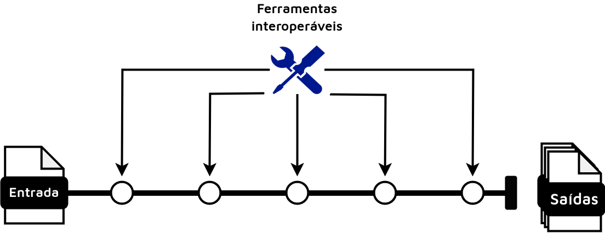

```{r include_packages, include = FALSE}
knitr::opts_chunk$set(echo = FALSE, cache = FALSE, message=FALSE, 
                      warning = FALSE, fig.ext='png', fig.align='center', 
                      fig.path = "images/", fig.pos = "H", dev = "png", 
                      dpi = 600, out.width = "70%")
type <- knitr::opts_knit$get("rmarkdown.pandoc.to")
# This chunk ensures that the ufscdown package is
# installed and loaded. This ufscdown package includes
# the template files for the thesis.
if(!require(remotes))
  install.packages("remotes", repos = "http://cran.rstudio.com")
if(!require(ufscdown))
  remotes::install_github("lfpdroubi/ufscdown")
library(ufscdown)
```

# Introdução {#intro}

## Histórico da Metagenômica

A história da vida microscópica, ou microbiana, no planeta Terra supera a história da vida macroscópica por milhares de anos [@magnabosco2024]. A metagenômica surge como uma abordagem que possibilita descobertas acerca da vida microbiana através do sequenciamento genético. Avanços no que viria eventualmente a se tornar a metagenômica surgem ainda nos anos 90, com o primeiro sequenciamento de genoma completo de um organismo de vida livre, a bactéria *Haemophilus influenza* [@wooley2010]. Esse ponto na história científica marca o primeiro uso bem sucedido do que vem a ser chamado de *whole-genome shotgun*, ou sequenciamento de genoma completo, no qual a amostra possui seu conteúdo genético fragmentado em *reads*, ou leituras, que são então sequenciadas. Essa técnica viria a ser refinada e aplicada para amostras ambientais, seja este ambiente uma amostra de solo florestal ou uma biópsia intestinal. Nessa nova técnica se buscou sequenciar o conteúdo genético que compreenda os diferentes microorganismos presentes em tais amostras, originando assim o que será aqui descrito como \gls{MS}.

No entanto, o estudo de comunidades microbianas se populariza de fato com uma técnica que não busca capturar o conteúdo genético total de uma amostra, mas apenas uma subregião de seu \gls{DNA} ribossomal que possua ao mesmo tempo regiões conservadas, capaz de serem passíveis de anelamento por *primers*, e regiões hipervariáveis, capazes de distinguir um microorganismo de outro. Em bactérias o ribotipo selecionado foi o \gls{DNA} que codifica a subunidade 16S, que é amplificada e então sequenciada. O \gls{16S}, também denominado metataxonômica [@marchesi2015], possibilitou uma maneira simples, e pouco computacionalmente intensiva quando comparada à \gls{MS} [@tremblay2022], para realizar identificação de táxons bacterianos em uma amostra ambiental. Ademais, técnicas computacionais posteriores ultimamente facilitariam a conexão de informação funcional às abundâncias taxonômicas obtidas através desta técnica.

Dessa maneira, possuímos atualmente, duas possíveis abordagens para se estudar comunidades microbianas, a \gls{MS} e o \gls{16S}. Essas abordagens, sobretudo a \gls{MS}, geram um alto volume de dados, e portanto, há a necessidade do desenvolvimento de ferramentas computacionais que processem esses dados e gerem informação científica que descreva de forma acurada e reproduzível achados acerca do microambiente do estudo [@comin2021].

## Desenvolvimento de Software Científico

Metodologias computacionais constituem parte indissociável da biologia molecular moderna, com novas ferramentas, abordagens e fluxos de trabalho, isto é, metodologias que agregam diversas ferramentas em sequência (Figura \@ref(fig:workflow)), surgindo a cada momento. Nesse contexto, muito tem se discutido acerca da qualidade do software desenvolvido, não apenas do ponto de vista de qualidade científica ou estatística da análise a ser realizada, mas também qualidade a partir de um ponto de vista técnico.

```{r workflow, fig.cap = "Diagrama que ilustra a estrutura geral de um fluxo de trabalho, compondo ferramentas que realizam diferentes etapas da análise", fig.pos = "H", fig.align='center'}

```

Tipicamente software é tratado como um ponto adjacente à uma análise científica, e não seu principal produto. Parcialmente isto se dá devido ao modelo de desenvolvimento de software científico atualmente vigente, que se dá por meio de projetos de doutorado e mestrado, dificultando, dessa maneira, manutenção a longo prazo [@altschul2013] [@mangul2019a]. Portanto, produzir metodologias que sejam usáveis a longo prazo sem necessitarem de alta manutenção é essencial. Nesse sentido, a utilização de tecnologias que facilitem a instalação de software, como gerenciadores de ambiente, ou tecnologias capazes de encapsular um ambiente computacional, como contêineres, são indispensáveis para a garantia de reprodutibilidade de qualquer método computacional, por garantirem o isolamento das dependências de um *software* indefinidamente [@kadri2022].

No entanto, garantir a capacidade de instalação do software é um ponto basal para determinar a qualidade de código científico. Outros princípios, aqui denominados como boas práticas de desenvolvimento de software científicos, são igualmente indispensáveis para que uma metodologia seja utilizável a longo prazo, além de capaz de gerar resultados científicos interpretáveis e consistentes. Além da instalabilidade, alguns outros princípios que garantem a qualidade de um software a longo prazo são uma documentação descritiva, com exemplos práticos de utilização, suporte multi-plataforma [@mangul2019] e, para softwares de processamento de dados, relatórios interativos ou logs acessíveis [@perkel2018]. A implementação de tais princípios em um *software* científico não apenas aumenta sua usabilidade, mas também aumenta as citações de seus artigos, aumentando, consequentemente, o alcance dessas metodologias [@mangul2019a].

## O Ecossistema computacional em Metagenômica

As metodologias de processamento de dados \gls{16S} em grande parte já estão estabelecidas, dada a idade mais avançada da abordagem. Nesse sentido, vemos que o cerne das abordagens trata de atribuir identificadores únicos às sequências 16S obtidas, caracterizando assim táxons distintos. Esses identificadores podem ser atribuídos através de métodos de agrupamento, caracterizando as abordagens baseadas em \gls{OTU}, que agrupam sequências com pelo menos 97% de identidade em grupos biológicos distintos, ou abordagens baseadas em \gls{ASV}, que, através de modelos estatísticos, tentam definir variações biológicas reais na sequência - contrastadas com variações devido a erros de sequenciamento, e dessa maneira obter uma resolução taxonômica maior comparada às baseadas em \gls{OTU} [@chiarello2022]. Nesse contexto, observamos metodologias que buscam, a partir dos \gls{OTU} ou \gls{ASV} identificados, inferir abundâncias de vias metabólicas específicas, tirando proveito de bancos de dados de informação curada a respeito desses táxons que possua mapeamento das famílias gênicas de seu genoma a funções biológicas [@douglas2020]. Quanto a fluxos de trabalho para processamento de dados \gls{16S}, destaca-se o *nf-core/ampliseq* [@straub2020], que implementa várias das boas práticas de software citadas anteriormente, como suporte multi-plataforma, documentação descritiva e exemplificada e relatórios automáticos interativos.

Por outro lado, o campo do desenvolvimento de metodologias para dados de \gls{MS} ainda é bastante fértil, com novas técnicas computacionais desenvolvidas rotineiramente [@liu2021]. De forma geral, podemos agrupar as metodologias em duas grandes categorias: Metodologias livres de montagem, isto é, aquelas que se utilizam apenas da informação contidas nas leituras para obter seus resultados, e metodologias baseadas em montagem, que primeiro realizam a montagem de leituras em sequências contíguas (ou \textit{contigs}), que fornecerá então a base para o processamento seguinte [@breitwieser2019]. Apesar da capacidade que métodos baseados em montagem tem de descobrir novos organismos e montar genomas inéditos, métodos livres de montagem apresentam certas vantagens, sobretudo quando consideramos dados com baixa cobertura de sequência, o que pode resultar em montagens pouco precisas [@ayling2020].

No que se diz respeito a essas metodologias, vemos que as baseadas em montagem são amplas e cobrem os mais diversos aspectos do processamento de dados de \gls{MS}, com exemplos como nf-core/mag [@krakau2022] e metaphor [@salazar2023]. No entanto, quando observamos métodos livres de montagem, vemos um cenário mais escasso, sobretudo quando consideramos apenas fluxos de trabalho, ou *workflows*, orquestrados por linguagems de gerenciamento de metodologias científicas, como Nextflow [@ditommaso2017] ou Snakemake [@mölder2021]. No contexto de métodos livres de montagem para dados \gls{MS}, vale ressaltar o fluxo de trabalho MEDUSA [@morais2022], que apresentou boa sensitividade e flexibilidade para análises de classificação taxonômica e anotação funcional.

Nesse sentido, há a necessidade de desenvolver uma metodologia para dados de \gls{MS} que siga boas práticas de desenvolvimento de software científico e que tenha como princípios norteadores a reprodutibilidade, documentação descritiva e prática e interpretabilidade. Este último ponto que se torna especialmente relevante ao considerarmos a complexidade e a alta dimensionalidade desses dados.
